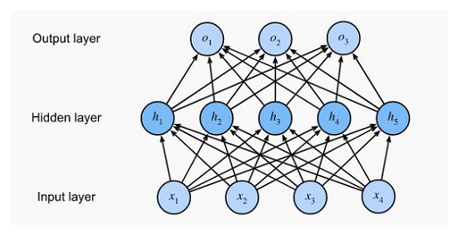
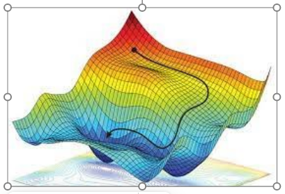
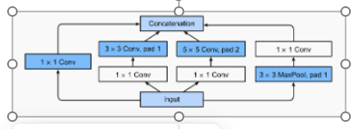
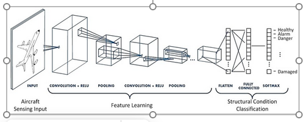
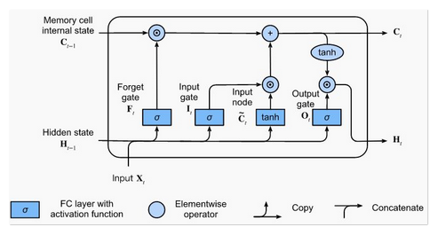
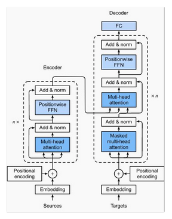

# Introduction to Neural networks

In this lecture we will be covering a lot of ground, some of which might require additional reading to understand fully what's going on. We will touch on a lot of different neural network architectures and how they are used. There will be several dependices that we will need to accomplish what we need to do. These are listed under `requirements.txt` file and you can install them using the command `pip install -r requirements.txt`. It would be beneficial for you to create a conda environmet prior to installation. You can find instructions [here](https://docs.conda.io/projects/conda/en/stable/user-guide/install/index.html) on how to do that. 

As we move towards more recent architectures things will get a little bit more advanced. Don't worry if they appear confusing at first. There are many resources you can use to read up on the intuition for these. 

### Outline

Here are the topics we will be covering, in each section we will discuss why we might want to use such an architecture, it's strengths and weakneses. With each new archtecture we will code **an extremely simplified** version just give you an idea about how they work and how to code them. After coding each of the model I will also introduce some resources where you can find larger ready to use/train models and repositories for open source/weight models. 

1. Simple fully connected feedforward networks
2. Convolutional neural networks
3. Recurrent neural networks (simple)
4. Long-Short Term memory (LSTM) networks
5. Attention networks
    1. Decoder only
    2. Encoder only
    3. Transformers
6. Graph neural networks
7. Variational Autoencoders


We will be building on top of our understanding (for the most part) from previous sections, sometimes this will be using code from the previous section directly other times, other times to understand why we are doing what we are doing. 

## What is a neural network?

Neural networks are a class of machine learning models that are primarily used in supervised learning tasks (there are some exceptions like self organizing maps, that we will not get into). The are composed of neurons (or perceptrons) that connnect to ther neurons. The final layer is another layer of neurons like no other with the exception that they are used to caluclate a loss function. 

#### Loss function?

This is a mathematical function that measures how *wrong* the model is. Our ultimate goal is to minimize the function at **all costs**. That's why the choice of metrics is extremely important for general purpose models like LLMs to avoid unwanted side effects. 


## Feed forward full connected neural networks

These are some of the simplest neural networks, they can be used on their own or they can be incorporated into larger strucutres. They consist of arbitrary number of laryers with arbitrary number of nodes. They can be used on tabular data (thoug if you have good features just use XGboost), they can be used to change the shape of the output of a layer so another layer coming after is compatible. 

They also have the ability to "store information" by creating a high (very high) dimensional representation of the data. This is where the information on an LLM is stored (or at least hypothesized to be stored). 

You can think of these as a "linear model made non-linear", the non-linearity comes from the activation function between these layers. Instead of passing the values as they are we either pass them if they are above a certain threshold of just return 0. There are many activation functions that one can use but the most popular ones are [`RELU`](https://en.wikipedia.org/wiki/Rectified_linear_unit) and its derivaties. 




```python
# an example

import torch
import torch.nn as nn
import torch.nn.functional as F


class SimpleMLP(nn.Module):
    def __init__(self, input_dim, hidden_dims=[128, 64], output_dim=10, dropout=0.1):
        super().__init__()
        layers = []
        dims = [input_dim] + hidden_dims
        for i in range(len(dims) - 1):
            layers.append(nn.Linear(dims[i], dims[i+1]))
            layers.append(nn.ReLU())
            if dropout > 0:
                layers.append(nn.Dropout(dropout))
        layers.append(nn.Linear(dims[-1], output_dim))
        self.net = nn.Sequential(*layers)

    def forward(self, x):
        return self.net(x)

model = SimpleMLP(input_dim=20, hidden_dims=[64, 32], output_dim=5) #differentiate between 5 classes
```

Now that we have our network we need to choose an optimizer and a loss function, an optimizer is used to minimze the loss function, it determines how the minimum is reached. The most commonly used one is [Adam](https://www.geeksforgeeks.org/deep-learning/adam-optimizer/) and its derivaties like AdamW. Each optimizer usually takes a learning rate argument, which determines how fast the model jupms as it tries to find the minimum. It's important to have a large enough learning rate to not get stuck on local minima, but small enough that you don't jump over your global minima. 




In larger more advanced models where the learning surface is more complicated, it's common practice to change the learning rate as the model learns. 


```python
opt = torch.optim.Adam(model.parameters(), lr=1e-3)
criterion = nn.CrossEntropyLoss() #this is common for multi-class classif
```


```python
for step in range(100):
    x = torch.randn(32, 20) #just random data
    y = torch.randint(0, 5, (32,))
    
    logits = model(x)
    loss = criterion(logits, y)
    
    opt.zero_grad()
    loss.backward()
    opt.step()
    
    if step % 10 == 0:
        print(f"Step {step}: loss={loss.item():.4f}")
```

    Step 0: loss=1.6061
    Step 10: loss=1.6099
    Step 20: loss=1.6164
    Step 30: loss=1.6012
    Step 40: loss=1.6053
    Step 50: loss=1.5909
    Step 60: loss=1.5994
    Step 70: loss=1.6050
    Step 80: loss=1.6166
    Step 90: loss=1.6110


## Convolutional neural networks

These are mainlyse used for image analysis, however they can be used of any type of data where the feature of interest can be anywhere in the data and it can take many shapes or forms. 

The main feature of a CNN is the convolution layer were we move through the data matrix and generate a higher order representation of the data and try and learn features "regadless of its location". This type of feature extraction is called "invariance" that is we can find the thing we are interested in using the same methods regadless of its location in the data. We will look at this in a bit more detail later when we look at equivariance in SO(3), SE(3) networks. 

The convolution layer in convolution networks can take many shapes, they can be as simple as a 2D convolution like below:


Or they can have multiple convolutions that are connected together like the inception module:



Regardless of the underlying architecture the idea is the same, we can stack different convolutional layers on top of each other to learn ever more abstract represntations of our data. When that is all done we can pass the learned features to small fully connected layer(s) to extract feature that are useful like image classification, object detection or segmentation. 

To add more "invariance" to our data it is common to use data augmentation, like cropping, rotating, changing colors etc, to make sure that we have a wide distrubution of representation of our features of interest, even if our dataset is more biased in one way or another. `torchvision` python package comes equipped with a large set of image augmentation methods that can be used out of the box. 

Let's assume we have a dataset of cat and dog pictures (and nothing else) and we want to have a binary classfier, our folder structures should look like this:

```
project/
│
├── data/
│   ├── train/
│   │   ├── cats/
│   │   │   ├── cat1.jpg
│   │   │   ├── cat2.jpg
│   │   │   └── ...
│   │   ├── dogs/
│   │   │   ├── dog1.jpg
│   │   │   ├── dog2.jpg
│   │   │   └── ...
│   │   └── ...
│   │
│   ├── val/
│   │   ├── cats/
│   │   ├── dogs/
│   │   └── ...
│   │
│   └── test/
│       ├── cats/
│       ├── dogs/
│       └── ...
│
└── train_cnn.py
```


```python
#let's do some data augmentation
import os

from torch.utils.data import DataLoader
from torchvision import datasets, transforms
from torchvision.transforms import InterpolationMode

train_transforms = transforms.Compose([
    transforms.RandomResizedCrop(128, scale=(0.8, 1.0)),  # random crop and resize
    transforms.RandomHorizontalFlip(p=0.5),               # mirror image
    transforms.RandomRotation(15, interpolation=InterpolationMode.BILINEAR),
    transforms.ColorJitter(brightness=0.2, contrast=0.2, saturation=0.2),
    transforms.ToTensor(),                                # convert to tensor [0,1]
    transforms.Normalize((0.5,), (0.5,))                  # normalize
])


# you probably don't want to go too crazy on your validataion set and you don't want to to anything to your test set
val_transforms = transforms.Compose([
    transforms.Resize(128),
    transforms.CenterCrop(128),
    transforms.ToTensor(),
    transforms.Normalize((0.5,), (0.5,))
])


train_dataset = datasets.ImageFolder(root=train_dir, transform=train_transforms)
val_dataset = datasets.ImageFolder(root=val_dir, transform=val_transforms)
```


```python

class SimpleCNN(nn.Module):
    def __init__(self, num_classes):
        super().__init__()
        self.conv1 = nn.Conv2d(3, 16, 3, padding=1)
        self.conv2 = nn.Conv2d(16, 32, 3, padding=1)
        self.pool = nn.MaxPool2d(2, 2)
        self.fc1 = nn.Linear(32 * 32 * 32, 128)
        self.fc2 = nn.Linear(128, num_classes)

    def forward(self, x):
        x = self.pool(F.relu(self.conv1(x)))  # -> [B,16,64,64]
        x = self.pool(F.relu(self.conv2(x)))  # -> [B,32,32,32]
        x = torch.flatten(x, 1)
        x = F.relu(self.fc1(x))
        x = self.fc2(x)
        return x

model = SimpleCNN(num_classes).to(device)
optimizer = torch.optim.Adam(model.parameters(), lr=1e-3)
criterion = nn.CrossEntropyLoss()
```


```python
for epoch in range(num_epochs):
    model.train()
    total_loss = 0
    for x, y in train_loader:
        x, y = x.to(device), y.to(device)
        optimizer.zero_grad()
        out = model(x)
        loss = criterion(out, y)
        loss.backward()
        optimizer.step()
        total_loss += loss.item()
    print(f"Epoch {epoch+1}: Train loss = {total_loss/len(train_loader):.4f}")
```

#### Some gotchas:

Unlike simple MLPs we cannot arbitrarily stack convolution layer, we need to pay attention to the starting and ending dimensions, We are converting a 2D matrix of our image (or 3D if you have RGB data) into higher dimensions. These are specificed by 3 parameters, 

+ Stride, how many pixels are you moving at each step
+ Kernel size (how big of a sub matrix you are using)
+ Padding, how much padding you want to have on each side of the image, this is important because if you have none you will not get the edges of the images in the centre of your kernel, if you have too much you are just processing 0s.

This then determines for a given image (or input size) your convoution layer

$$ output size = \frac{W-K+2P}{S}+1 $$

where S is stride, K is kernel size, P is padding and W is image width/height (for a square picture). 

Then we pool our data to to compress the information in the first convoltion layer (that's the `Maxpool2d`) layer. 

At the very end we flatten our vector to a 1d vector because we want to be able to attach a find fully connected layer to get the ouptut we want like class labels. 



For ready to use/train models there are couple of resources you can check

YOLO is one of the best size/performace ratio model out there for segmentation and object detection, they have a lot of pre-trained models and you can easily train your own using their documentation [here](https://docs.ultralytics.com/). 

Additionally [timm](https://huggingface.co/timm) has a lot of classic CNN architectures and pre-trained models for basic usage and training scripts as well. 

## Recurrent neural networks

These models intially were designed to deal with text if a text is considered a linear sequence of things (which it is not, see transformers). For short texts they performed ok but they lacked 3 important features:

1. No non-sequential dependencies
2. No parallel processing (you need n-1th step to process step n)
3. Probabilities vanish to 0 for longer context becuse for $x \in \mathbb{R}$ and $x<1$ $y*x<y$


Assuming that we have a text file called `training.txt`


```python
#let's code one

class SimpleRNN(nn.Module):
    def __init__(self, vocab_size, embed_dim=128, hidden_dim=256):
        super().__init__()
        self.embed = nn.Embedding(vocab_size, embed_dim)
        self.rnn = nn.RNN(embed_dim, hidden_dim, batch_first=True) #you can just add the num_layers param to add more back to back
        self.fc = nn.Linear(hidden_dim, vocab_size)

    def forward(self, x, hidden=None):
        x = self.embed(x)
        out, hidden = self.rnn(x, hidden)
        logits = self.fc(out)
        return logits, hidden
```

This is as simple as a RNN can get, if we want to add more features to it like additional hidden RNN layers for more abstraction or normalization via another mlp we can do it like so:


```python
class ManualStackedRNN(nn.Module):
    def __init__(self, vocab_size, embed_dim=128, hidden_dims=[128, 256, 256]):
        super().__init__()
        self.embed = nn.Embedding(vocab_size, embed_dim)

        self.rnns = nn.ModuleList()
        input_dim = embed_dim
        for hidden_dim in hidden_dims:
            self.rnns.append(nn.RNN(input_dim, hidden_dim, batch_first=True)) #here you can define the logic, like you can add a linear layer or some other things
            input_dim = hidden_dim

        # Optional nonlinearities between RNN layers
        self.activ = nn.ReLU()
        self.fc = nn.Linear(hidden_dims[-1], vocab_size)

    def forward(self, x):
        x = self.embed(x)
        for rnn in self.rnns:
            x, _ = rnn(x)
            x = self.activ(x)
        logits = self.fc(x)
        return logits
```

These models still work pretty well for time series data but they still suffer from the same issues. To combat these there were many architectures were proposed, one of the more successful ones were long-short term memory architectures, where instead of just using simple hidden layer we add on additional features like what to remmember and what to forget (something called a forget gate), we then combine all this information in a matrix addition layer before we pass it on to the next block. 




```python
class SimpleLSTM(nn.Module):
    def __init__(self, vocab_size, embed_dim=128, hidden_dim=256):
        super().__init__()
        self.embed = nn.Embedding(vocab_size, embed_dim)
        self.lstm = nn.LSTM(embed_dim, hidden_dim, batch_first=True) #same idea you can add more with num_layers
        self.fc = nn.Linear(hidden_dim, vocab_size)

    def forward(self, x, hidden=None):
        x = self.embed(x)
        out, hidden = self.lstm(x, hidden)
        logits = self.fc(out)
        return logits, hidden
```


```python
# create the dataset
from torch.utils.data import Dataset

class TextDataset(Dataset):
    def __init__(self, file_path, seq_len=30):
        with open(file_path, 'r', encoding='utf-8') as f: #read it line by line
            text = f.read().lower()

        # Simple tokenization (split on non-alphanumeric)
        self.tokens = re.findall(r'\b\w+\b', text) #split by white space, more sophisticated methods below

        # Build vocab
        vocab = sorted(set(self.tokens)) #get unique words, words like can't is different than can+not
        self.stoi = {w: i for i, w in enumerate(vocab)}
        self.itos = {i: w for w, i in self.stoi.items()}

        # Convert to indices
        self.indices = [self.stoi[t] for t in self.tokens] #convert them to numbers, this is arbitrary the actual number is meaningless and that's a good thing

        self.seq_len = seq_len

    def __len__(self):
        return len(self.indices) - self.seq_len

    def __getitem__(self, idx):
        x = torch.tensor(self.indices[idx:idx+self.seq_len], dtype=torch.long)
        y = torch.tensor(self.indices[idx+1:idx+self.seq_len+1], dtype=torch.long)
        return x, y
```


```python
#let's train

model=SimpleLSTM(vocab_size=10_000)

optimizer = torch.optim.Adam(model.parameters(), lr=lr)
criterion = nn.CrossEntropyLoss()

for epoch in range(epochs):
    total_loss = 0
    for x, y in loader:
        x, y = x.to(device), y.to(device)
        optimizer.zero_grad()

        logits, _ = model(x)
        loss = criterion(logits.view(-1, logits.size(-1)), y.view(-1))

        loss.backward()
        optimizer.step()
        total_loss += loss.item()

    print(f"Epoch {epoch+1}/{epochs} | Loss: {total_loss/len(loader):.4f}")
```

## Attention is all you need

The attention mechanism was first introduces in 2017 with this [paper](https://arxiv.org/abs/1706.03762). The idea was to model the dependency of every word to every other word in the text. This proved to be a very powerful model and almost all of the languge models that we used today use some sort of an attention mechanism. This was later applied to vision models with vision transformer and even protein structures (AF2 is a tranformer model with additional bells and whistles). 


The attention mechanims (a single head attention) uses a query, key, value method. For a given key (k) and value (v) collection D(k,v) we can calculate the attention for any query (q), that is the relevance of the query given the text. 

$$ Attention(q, D)=\sum_i^m{\alpha(q, k_i)v_i} $$

Where $\alpha=softmax(q, k_i)$

Of course when it comes to any neural network, more is more, so we can add multiple attention layers and create a multihead attention head. 

Each attention head can take 2 flavors, an encoder and a decoder. As the names suggest the encoder is there to "understand" the what's going on in the text and the "decoder" is there to predict the next token. A combination of these form the tranfromer architecture. You can use them together (like GPT) or all encoder models (like BERT) depending on your use case. 

Let's start with a decoder only model


```python


class DecoderOnly(nn.Module):
    def __init__(self, vocab_size, d_model=128, n_heads=4, n_layers=2, dim_feedforward=512, dropout=0.1, max_len=128):
        super().__init__()
        self.token_emb = nn.Embedding(vocab_size, d_model)
        self.pos_emb = nn.Embedding(max_len, d_model)

        decoder_layer = nn.TransformerDecoderLayer( #define what a layer looks like
            d_model=d_model,
            nhead=n_heads,
            dim_feedforward=dim_feedforward,
            dropout=dropout,
            batch_first=True
        )
        
        self.decoder = nn.TransformerDecoder(decoder_layer, num_layers=n_layers) #implement it N times for extra abstraction
        self.lm_head = nn.Linear(d_model, vocab_size, bias=False)
        
        self.register_buffer("mask", torch.tril(torch.ones(max_len, max_len)).bool()) #see below

    def forward(self, x):
        B, T = x.shape
        pos = torch.arange(T, device=x.device)
        x = self.token_emb(x) + self.pos_emb(pos)
        
        # Causal mask to prevent attending to future tokens
        causal_mask = self.mask[:T, :T]
        out = self.decoder(x, x, tgt_mask=~causal_mask)
        logits = self.lm_head(out)
        return logits
```

This looks simple enough becaue we have the `TranfomerDecoderLayer` that determines how many heads we will use in multihead attention and then how many neuron in you linear layer (see below) and a few other things. Then we can implement the decoder only architecture by repeating the decoder layer n times with `TransformerDecoder`

this part 

```python
self.register_buffer("mask", torch.tril(torch.ones(max_len, max_len)).bool())
```

Is there to make sure that the transfomer does not cheat while training. The way we are going to train these models is by predicting the next token and seeing how well the model performs. If during training we give the architecture to the full text, then it already knows what comes next. So we are adding an attention mask where 0 means don't look. So a triangular matrix looks like 

```
[[1, 0, 0, 0, 0],
 [1, 1, 0, 0, 0],
 [1, 1, 1, 0, 0],
 [1, 1, 1, 1, 0],
 [1, 1, 1, 1, 1]]
```

which means nth word can only look at up to the nth word. Everything else is off limits. 

Encoder models are different, they are trained using masked language modelling which means they can see the whole text except for an n% (usually 15-25%) randomly removed. This forces them to understand the context better instead of blurting the next token. These are generally useful for text classification instead of text generation. 


```python
class SimpleTransformerEncoder(nn.Module):
    def __init__(self, vocab_size, d_model=128, nhead=4, num_layers=2, dim_feedforward=256, max_len=100, num_classes=2, dropout=0.1):
        super().__init__()

        # Embedding layers
        self.token_embed = nn.Embedding(vocab_size, d_model) #same as above we'll look at that in a min
        self.pos_embed = nn.Embedding(max_len, d_model)

        # Stack of encoder layers
        encoder_layer = nn.TransformerEncoderLayer(
            d_model=d_model,
            nhead=nhead,
            dim_feedforward=dim_feedforward,
            dropout=dropout,
            activation="relu", #because we are learning and storing information, we need some sort of way to add no-linearity
            batch_first=True,   # Important for (batch, seq, feature) ordering
        )

        self.encoder = nn.TransformerEncoder(encoder_layer, num_layers=num_layers)

        # Optional output head (for classification or embeddings)
        self.fc = nn.Linear(d_model, num_classes)

    def forward(self, x):
        """
        x: LongTensor of shape (batch, seq_len)
        """
        batch_size, seq_len = x.size()
        device = x.device

        # Create positional indices (0, 1, 2, ..., seq_len-1)
        pos = torch.arange(seq_len, device=device).unsqueeze(0).expand(batch_size, seq_len)

        # Add token + positional embeddings
        x = self.token_embed(x) + self.pos_embed(pos)

        # Pass through the transformer encoder
        encoded = self.encoder(x)

        # Pooling: take mean across sequence dimension
        pooled = encoded.mean(dim=1)

        # Output
        out = self.fc(pooled)
        return out
```

### Putting it all together, the transformer

A model like GPT uses both encoders and decoders to improve performance. Encoders are used to "understand" what's going on and given our understanding of the text we can then use decoders to predict the next token. 



Before we code a mini tranformers we need to look into positional encoding. If you remember we are comparing every word to every other word, this means we are losing posittional information. When it comes to text the position of a word is an importatn piece of information. How can we put it back. We can do that by addition additional but unrelated information. The intial transfomer paper used a bunch of sine and cosine values added all toghether to create a unique number that is associated with the tokens' position. 

We are also genearing an embedding space, where we can store and learn what the text is talking about. These two are combined to generate a final vector of n dimensions (of our choosing) for every token. 


| Token | token_embed            | pos_embed                 | sum (final input)          |
| ----- | ---------------------- | ------------------------- | -------------------------- |
| "the" | [0.1, 0.2, -0.4, 0.6]  | [0.05, 0.03, 0.01, 0.02]  | [0.15, 0.23, -0.39, 0.62]  |
| "cat" | [-0.2, 0.3, 0.1, -0.5] | [0.04, 0.01, -0.02, 0.03] | [-0.16, 0.31, 0.08, -0.47] |
| "sat" | [0.3, -0.1, 0.2, 0.5]  | [0.02, 0.02, 0.00, 0.01]  | [0.32, -0.08, 0.20, 0.51]  |


```python
class SimpleTransformer(nn.Module):
    def __init__(self, vocab_size, embed_dim=64, num_heads=4, ff_dim=128, num_layers=2, max_len=128):
        super().__init__()
        # encoder and decoder embeddings
        self.src_emb = nn.Embedding(vocab_size, embed_dim)
        self.tgt_emb = nn.Embedding(vocab_size, embed_dim)
        self.pos_emb = nn.Embedding(max_len, embed_dim)

        # stacks
        self.encoder_layers = nn.ModuleList([
            EncoderBlock(embed_dim, num_heads, ff_dim) for _ in range(num_layers)
        ])
        self.decoder_layers = nn.ModuleList([
            DecoderBlock(embed_dim, num_heads, ff_dim) for _ in range(num_layers)
        ])

        self.output_proj = nn.Linear(embed_dim, vocab_size)

    def forward(self, src, tgt):
        B, S = src.shape
        _, T = tgt.shape
        src_pos = torch.arange(0, S, device=src.device).unsqueeze(0)
        tgt_pos = torch.arange(0, T, device=tgt.device).unsqueeze(0)

        src_emb = self.src_emb(src) + self.pos_emb(src_pos)
        tgt_emb = self.tgt_emb(tgt) + self.pos_emb(tgt_pos)

        # Encoder
        for layer in self.encoder_layers:
            src_emb = layer(src_emb)

        # Causal mask to prevent attending to future tokens
        causal_mask = torch.triu(torch.ones(T, T, device=tgt.device), diagonal=1).bool()

        # Decoder
        for layer in self.decoder_layers:
            tgt_emb = layer(tgt_emb, src_emb, self_mask=causal_mask)

        # Final projection
        logits = self.output_proj(tgt_emb)
        return logits
```

This is all well and good, but how do we transform words into numbers. We talked about splitting them into words based on white space but that is not the best way to do that. We can use something called [byte-pair encoding](https://huggingface.co/learn/llm-course/en/chapter6/5) to split our text into tokens. This is something "we train" before we even start training our models. Luckily the huggingface repository has a bunch of tokenizers that are ready to use out of the box and we don't even need to worry about training them. 


```python
from tokenizers import ByteLevelBPETokenizer

#train your own
tokenizer = ByteLevelBPETokenizer()
tokenizer.train(["training.txt"], vocab_size=8000, min_frequency=2)
tokenizer.save_model("tokenizer/")

# or a pretrained one
from transformers import GPT2Tokenizer, GPT2Model
tokenizer = GPT2Tokenizer.from_pretrained('gpt2')


batch = tokenizer(texts, padding=True, truncation=True, return_tensors="pt")

```

### Graph neural networks

So far we have modelled things using information that is implied in their structure, like nearby pixels are more likely to contain infromation relalted to each other, or modelling the fully connected relationship between words etc. There is one domain of data where we can start with a known relationship and then model things related to those relationships. Here we will look at graphs, they represetn connections between things (nodes) and how they are connected (edges). A simple example would be a social network or a molecule. Things are connected to each other and different connections can have different properties (single bond, double bond etc.)

We have been traininin neural networks on graphs this entire time we just never relally made that explicit. Let's do that. 


For this task we will be using a package that is designed to express relationships between things explicity. [Pytorch geometric]() is one of the most popular graph neural network libraries due to its comprehensive collection of function and layers and its ease of use. Additionally we will be using RDKit (a cheminformatics package) to convert our smiles strings into graphs. 


```python
import torch
import torch.nn as nn
import torch.nn.functional as F
from torch_geometric.data import Data, Dataset, DataLoader
from torch_geometric.nn import GCNConv, global_mean_pool
from rdkit import Chem
from rdkit.Chem import AllChem
import pandas as pd

def smiles_to_graph(smiles, label):
    mol = Chem.MolFromSmiles(smiles)
    if mol is None:
        return None

    # Node features: one-hot atom type (C,H,O,N,F, etc.)
    atom_types = ['H','C','N','O','F','P','S','Cl','Br','I']  # basic set
    x = []
    for atom in mol.GetAtoms(): #RDKit specific functions
        one_hot = [0]*len(atom_types)
        sym = atom.GetSymbol()
        if sym in atom_types:
            one_hot[atom_types.index(sym)] = 1
        x.append(one_hot)
    x = torch.tensor(x, dtype=torch.float)

    # Edge indices
    edge_index = []
    for bond in mol.GetBonds():
        i = bond.GetBeginAtomIdx()
        j = bond.GetEndAtomIdx()
        edge_index.append([i,j])
        edge_index.append([j,i])  # undirected graph the connection between Atom1 and Atom2 is the same as connection between Atom2 and Atom1
    if len(edge_index) == 0:
        edge_index = torch.zeros((2,0), dtype=torch.long)
    else:
        edge_index = torch.tensor(edge_index, dtype=torch.long).t().contiguous()

    y = torch.tensor([label], dtype=torch.long)
    return Data(x=x, edge_index=edge_index, y=y)


class MoleculeDataset(Dataset):
    def __init__(self, csv_file):
        self.df = pd.read_csv(csv_file)
        self.graphs = []
        for _, row in self.df.iterrows():
            g = smiles_to_graph(row['smiles'], row['label'])
            if g is not None:
                self.graphs.append(g)

    def len(self):
        return len(self.graphs)

    def get(self, idx):
        return self.graphs[idx]
```


```python
class SimpleGNN(nn.Module):
    def __init__(self, in_channels, hidden_channels=64, num_classes=2):
        super().__init__()
        self.conv1 = GCNConv(in_channels, hidden_channels) #same as a convolution just on graphs instead of matrices
        self.conv2 = GCNConv(hidden_channels, hidden_channels)
        self.lin = nn.Linear(hidden_channels, num_classes) 

    def forward(self, x, edge_index, batch):
        x = F.relu(self.conv1(x, edge_index))
        x = F.relu(self.conv2(x, edge_index))
        x = global_mean_pool(x, batch)  # graph-level embedding
        x = self.lin(x)
        return x
```


```python
model = SimpleGNN(in_channels).to(device)
optimizer = torch.optim.Adam(model.parameters(), lr=1e-3)
criterion = nn.CrossEntropyLoss()

for epoch in range(epochs):
    model.train()
    total_loss = 0
    for batch in train_loader:
        batch = batch.to(device)
        optimizer.zero_grad()
        out = model(batch.x, batch.edge_index, batch.batch)
        loss = criterion(out, batch.y)
        loss.backward()
        optimizer.step()
        total_loss += loss.item()
    print(f"Epoch {epoch+1}: Train loss = {total_loss/len(train_loader):.4f}")
```

### Generative models

So far we were interested in classification (GPTs are classfiers if you think about it), how about generating new things, The simplest model for this is a variational autoencoder. The variational part is just there to add some variability to the input data so you don't generate the same thing all the time. 

This is a simple thing to do, we've already written a convolutional neural net where we take an image and return a vector or matrix of what we think of it, we can do the opposite as well, we can take an "undestanding" and return an image. In the example below we are not returning an image but a vector of similar things. Keep in mind that you can use just about any kind of model between encoder and decoder, the dimensions of the latent variables need to match, that's about it. 


1. **Encoder outputs a mean and log-variance** of the latent Gaussian:
   $$ \mu, \log\sigma^2 = \text{Encoder}(x) $$

2. **Reparameterization trick**: sample ( z ) from latent distribution while keeping it differentiable:
   $$ z = \mu + \sigma \odot \epsilon, \quad \epsilon \sim \mathcal{N}(0, 1) $$

3. **Decoder** reconstructs ( x ) from ( z ).

4. **Loss function** = Reconstruction Loss + KL Divergence:
   $$  \mathcal{L} = \text{MSE/BCELoss} + \frac{1}{2} \sum(1 + \log\sigma^2 - \mu^2 - \sigma^2) $$


```python
import torch
import torch.nn as nn
import torch.optim as optim
from torchvision import datasets, transforms
from torch.utils.data import DataLoader

# ----------------------------
# VAE Model
# ----------------------------
class VAE(nn.Module):
    def __init__(self, input_dim=784, latent_dim=64):
        super().__init__()
        # Encoder
        self.fc1 = nn.Linear(input_dim, 256)
        self.fc2 = nn.Linear(256, 128)
        self.fc_mu = nn.Linear(128, latent_dim)
        self.fc_logvar = nn.Linear(128, latent_dim)

        # Decoder
        self.fc3 = nn.Linear(latent_dim, 128)
        self.fc4 = nn.Linear(128, 256)
        self.fc5 = nn.Linear(256, input_dim)
        self.activation = nn.ReLU()
        self.output_activation = nn.Sigmoid()  # for normalized images

    def encode(self, x):
        h = self.activation(self.fc1(x))
        h = self.activation(self.fc2(h))
        mu = self.fc_mu(h)
        logvar = self.fc_logvar(h)
        return mu, logvar

    def reparameterize(self, mu, logvar):
        std = torch.exp(0.5 * logvar)
        eps = torch.randn_like(std)
        return mu + eps * std

    def decode(self, z):
        h = self.activation(self.fc3(z))
        h = self.activation(self.fc4(h))
        return self.output_activation(self.fc5(h))

    def forward(self, x):
        x = x.view(x.size(0), -1)
        mu, logvar = self.encode(x)
        z = self.reparameterize(mu, logvar)
        x_recon = self.decode(z)
        return x_recon, mu, logvar

```

The variation in the variational autoencoder comes from that gausian noise we add at the beginning, there is another more powerful way to generate things. What if we pit two neural network agains each other and keep training them until they can no longer tell what' real and what' not. These are call the generative adversarial networks. There is model that generates things and there is a disscriminator that determines whether it's real or not. 


```python
import torch
import torch.nn as nn
import torch.optim as optim
from torchvision import datasets, transforms
from torch.utils.data import DataLoader

class Generator(nn.Module):
    def __init__(self, latent_dim=64, img_dim=784):
        super().__init__()
        self.model = nn.Sequential(
            nn.Linear(latent_dim, 128),
            nn.ReLU(),
            nn.Linear(128, 256),
            nn.ReLU(),
            nn.Linear(256, img_dim),
            nn.Tanh()  # outputs in [-1, 1]
        )

    def forward(self, z):
        return self.model(z)


class Discriminator(nn.Module):
    def __init__(self, img_dim=784):
        super().__init__()
        self.model = nn.Sequential(
            nn.Linear(img_dim, 256),
            nn.LeakyReLU(0.2),
            nn.Linear(256, 128),
            nn.LeakyReLU(0.2),
            nn.Linear(128, 1),
            nn.Sigmoid()  # probability real/fake
        )

    def forward(self, x):
        return self.model(x)

```


```python
# Hyperparameters
batch_size = 128
lr = 2e-4
latent_dim = 64
img_dim = 28*28
num_epochs = 5

# Data
transform = transforms.Compose([
    transforms.ToTensor(),
    transforms.Normalize([0.5], [0.5])  # normalize to [-1,1] for Tanh output
])
train_data = datasets.MNIST(root="./data", train=True, download=True, transform=transform)
train_loader = DataLoader(train_data, batch_size=batch_size, shuffle=True)

# Models
device = "cuda" if torch.cuda.is_available() else "cpu"
G = Generator(latent_dim, img_dim).to(device)
D = Discriminator(img_dim).to(device)

# Optimizers
opt_G = optim.Adam(G.parameters(), lr=lr)
opt_D = optim.Adam(D.parameters(), lr=lr)

# Loss
criterion = nn.BCELoss()

```


```python
for epoch in range(num_epochs):
    for imgs, _ in train_loader:
        imgs = imgs.view(imgs.size(0), -1).to(device)
        batch_size_curr = imgs.size(0)

        # ---------------------
        # Train Discriminator
        # ---------------------
        z = torch.randn(batch_size_curr, latent_dim).to(device)
        fake_imgs = G(z)

        real_labels = torch.ones(batch_size_curr, 1).to(device)
        fake_labels = torch.zeros(batch_size_curr, 1).to(device)

        # Loss for real images
        loss_real = criterion(D(imgs), real_labels)
        # Loss for fake images
        loss_fake = criterion(D(fake_imgs.detach()), fake_labels)
        loss_D = (loss_real + loss_fake) / 2

        opt_D.zero_grad()
        loss_D.backward()
        opt_D.step()

        # ---------------------
        # Train Generator
        # ---------------------
        z = torch.randn(batch_size_curr, latent_dim).to(device)
        fake_imgs = G(z)
        # Generator wants D to predict them as real
        loss_G = criterion(D(fake_imgs), real_labels)

        opt_G.zero_grad()
        loss_G.backward()
        opt_G.step()

    print(f"Epoch [{epoch+1}/{num_epochs}] | Loss_D: {loss_D.item():.4f} | Loss_G: {loss_G.item():.4f}")

```


```python

```

### Pre-trained models and where to find them

1. Huggingface
2. Papers and their respective repositories

Huggingface and their respective ecosystem `tranformers`, `datasets`, `bitsandbytes`, `peft` makes using, fine tuning and tranining models as easy as it could be. They have extensive documentation and 1000s of models for many different tasks that you can use out of the box or fine tune with ease.


## What we have not covered

There are few things we have not covered in this lecture for couple of reasons, one is time and the other is they are bit more advanced, these are

1. Diffusion models
2. Invarance/equivariance and how scale rotation can be mapped using lie agebra.

These models have been gaining traction for image generation (diffusion) and navigating the real world (self driving cars, robotics) (SE(3), SO(3)). 


